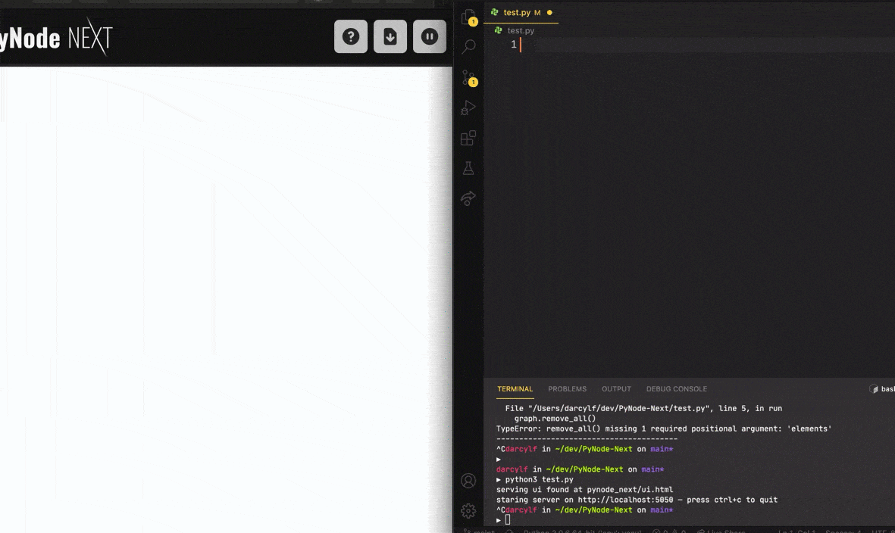

:doctype: book
:t_generic_text: pass:[<code class="literal">str</code>, <code class="literal">int</code> or <code class="literal">float</code>] 
:t_generic_number: pass:[<code class="literal">int</code> or <code class="literal">float</code>] 

:t_node_generic: pass:[<code class="literal">Node</code>, <code class="literal">str</code>, <code class="literal">int</code> or <code class="literal">float</code>]

:t_node: pass:[<code class="literal">Node</code>]
:t_edge: pass:[<code class="literal">Edge</code>]
:t_color: pass:[<code class="literal">Color</code>]

:toc: macro

++++

  

++++

[discrete]
= PyNode Next

> A complete rewrite of PyNode for the modern era.

PyNode Next allows you to easily create beautiful graph visualisations and animations. 

Find out more at https://ehne.github.io/PyNode-Next

---

Created by https://github.com/ehne[@ehne] in 2021. Based on PyNode by https://github.com/alexsocha[@alexsocha]. image:https://www.codefactor.io/repository/github/ehne/pynode-next/badge/main[]
